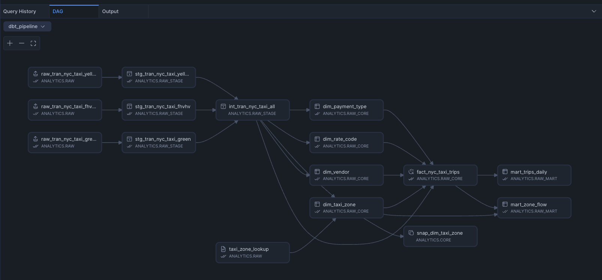
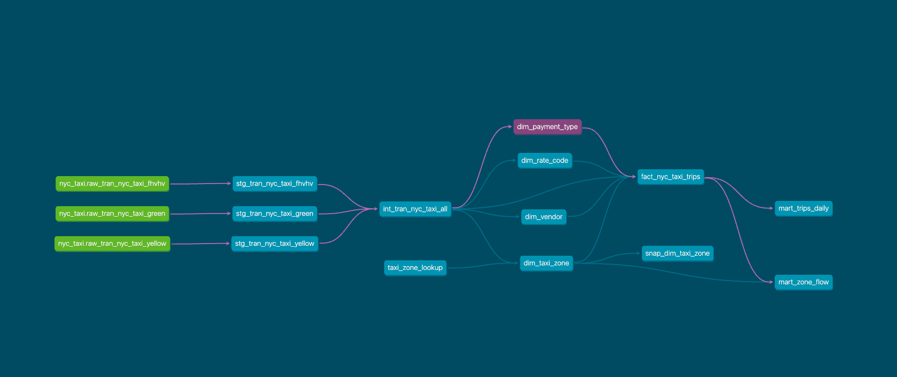
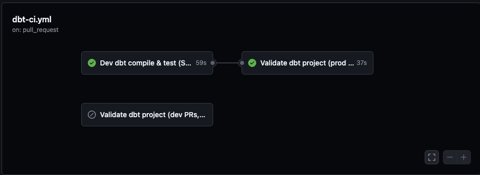

# Getting Started – Snowflake dbt Stack

This guide walks you through prerequisites, local setup, deployment, and day‑to‑day operations for the NYC Taxi dbt project.

## 1. Prerequisites

- Snowflake account with a role that can create warehouses/schemas (already covered by `snowflake_scripts/step_01_initial_setup.sql`).
- Python 3.10+ with `pip`.
- SnowSQL CLI (for PUT commands) – optional if you already uploaded files.
- SSH key pair for Snowflake key auth (`~/.ssh/snowflake_keys/dbt_svc_rsa_key.p8`).
- Access to public NYC TLC parquet files (upload instructions in `snowflake_scripts/step_03_raw_stage_upload.sql`).

## 2. Environment Bootstrap

```bash
git clone https://github.com/<your-org>/snowflake-dbt-stack.git
cd "snowflake-dbt-stack"

# Python env
python -m venv .venv_dbt
source .venv_dbt/bin/activate
pip install dbt-snowflake

# Point dbt at the in-repo profile + Snowflake creds
export DBT_PROFILES_DIR="$(pwd)/dbt_pipeline"
export SNOWFLAKE_ACCOUNT=JNAEVTS-ZZC51360
export SNOWFLAKE_USER=DBT_SVC
export SNOWFLAKE_ROLE=DBT_ETL
export SNOWFLAKE_WAREHOUSE=DBT_WH_M
export SNOWFLAKE_DATABASE=ANALYTICS
export SNOWFLAKE_SCHEMA=RAW
export SNOWFLAKE_PRIVATE_KEY_PATH=/Users/sahilbhange/.ssh/snowflake_keys/dbt_svc_rsa_key.p8
export SNOWSQL_PRIVATE_KEY_PASSPHRASE=<passphrase>

# Install dbt packages
dbt --project-dir dbt_pipeline deps
```

## 3. Raw Data Ingestion

1. Download TLC parquet files under `data/nyc_tlc/{yellow,green,fhvhv}` (see commands in `snowflake_scripts/step_03_raw_stage_upload.sql`).
2. Upload them to Snowflake using SnowSQL PUT commands:
   ```sql
   PUT 'file:///Users/<user>/snowflake-dbt-stack/data/nyc_tlc/yellow/*.parquet'
       @ANALYTICS.UTIL.NYC_TLC_STAGE/yellow AUTO_COMPRESS=FALSE;
   # Repeat for green & fhvhv
   ```
3. Run the ingestion macro so RAW tables are recreated via `INFER_SCHEMA` and loaded:
   ```bash
   dbt --project-dir dbt_pipeline run-operation ingest_nyc_tlc_from_stage
   ```

## 4. Build Order (dbt DAG)

```bash
dbt --project-dir dbt_pipeline run --select 'staging.nyc_taxi.stg_tran_nyc_taxi_*'
dbt --project-dir dbt_pipeline run --select intermediate.nyc_taxi.int_tran_nyc_taxi_all
dbt --project-dir dbt_pipeline run --select 'core.nyc_taxi.dim_*'
dbt --project-dir dbt_pipeline run --select core.nyc_taxi.fact_nyc_taxi_trips
dbt --project-dir dbt_pipeline run --select path:marts
dbt --project-dir dbt_pipeline test
dbt --project-dir dbt_pipeline snapshot   # optional SCD2
dbt --project-dir dbt_pipeline docs generate
```

dbt automatically executes each layer in topological order; independent models (stage layer, dims, marts) run in parallel.

## 5. DAG Visualization



You can also run `dbt docs generate && dbt docs serve` and open the Graph tab for an interactive view.



The same docs are also published via GitHub Pages at:

`https://sahilbhange.github.io/snowflake-dbt-stack/dbt_docs/#!/overview`

To refresh the hosted docs after a code change:

1. Rebuild docs from `dbt_pipeline/`:
   ```bash
   dbt docs generate --target dev
   ```
2. From the repo root, sync the static site:
   ```bash
   rm -rf docs/dbt_docs/*
   cp -R dbt_pipeline/target/* docs/dbt_docs/
   git add docs/dbt_docs
   git commit -m "Refresh dbt docs (dev)"
   git push
   ```

## 6. Project Layout

- `dbt_pipeline/models/staging/nyc_taxi/` – view models cleaning yellow/green/fhvhv trips.
- `dbt_pipeline/models/intermediate/` – union canonical model.
- `dbt_pipeline/models/core/` – dimensions + incremental fact.
- `dbt_pipeline/models/marts/` – reporting tables.
- `dbt_pipeline/macros/nyc_tlc_ingestion.sql` – local stage ingest macro.
- `snowflake_scripts/*.sql` – Snowflake role/warehouse setup & manual ingest instructions.
- `docs/` – DAG + project overview.

## 7. Snowflake Native Execution

In a Snowflake Worksheet workspace, run `dbt deps`, then `dbt run`/`dbt test` with `project_root='/dbt_pipeline'`. Ensure environment vars/connection secrets are configured in the workspace session (same values as above).

## 8. CI/CD: GitHub Actions + Snowflake Workspace

This project is designed so that:

- **Snowflake Workspace** owns real dbt orchestration (dev/prod runs, schedules, lineage, costs).
- **GitHub Actions** validates changes on pull requests.

### 8.1 Workflow summary

**File:** `.github/workflows/dbt-ci.yml`

Triggers on:

- `pull_request` to `dev` or `main`.

Jobs:

- `validate_dev` (PRs → `dev`)
  - Runs in `dbt_pipeline/`.
  - `dbt deps`
  - `dbt parse --target dev` (no Snowflake connection).
  - `python scripts/validate_dbt_metadata.py` to enforce docs/tests on core & marts.
  - Light, non‑blocking SQLFluff lint on `models/core` and `models/marts` (Snowflake dialect, Jinja templater).

- `dev_tests`
  - Uses Snowflake **DEV** credentials from GitHub secrets.
  - `dbt deps`
  - `dbt compile --target dev`
  - `dbt test --target dev` (executes tests against the DEV warehouse).

- `validate_prod` (PRs → `main`)
  - Runs only when `github.base_ref == 'main'` and **after** `dev_tests` (via `needs: dev_tests`).
  - `dbt deps`
  - `dbt parse --target prod`
  - `python scripts/validate_dbt_metadata.py`
  - Light, non‑blocking SQLFluff lint on core & marts (no Snowflake connection).

Example GitHub Actions run showing the dev→prod sequence:



This means:

- Every PR must pass `dbt compile`/`dbt test` on Snowflake DEV.
- For PRs into `main`, prod configuration must also compile, but no PROD runs/tests ever happen from GitHub.

For a more detailed CI/CD reference (including secrets, environment variables, and local equivalents), see `dbt_learning/dbt_cicd_github_actions.md`.

## 9. Troubleshooting

- **Packages missing**: run `dbt deps` inside the environment (workspace or local) before `dbt run`.
- **Path errors**: set `DBT_PROFILES_DIR` to the absolute path of `dbt_pipeline` from your current working directory.
- **No RAW tables**: rerun `dbt run-operation ingest_nyc_tlc_from_stage` after uploading files.
- **dim/fact missing**: build intermediate + dims before running the fact (`dbt run --select intermediate...`, `dbt run --select 'core.nyc_taxi.dim_*'`).

You now have a reproducible, production-style dbt+Snowflake pipeline modeled after the Snowflake Labs getting-started project.
